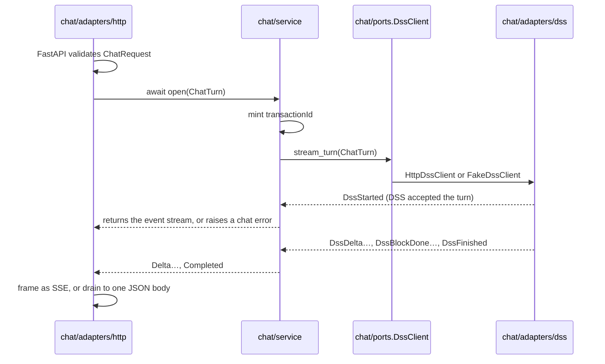

# ADR-0001: Architecture of the Experience API

- **Status:** ACCEPTED
- **Date:** 2026-09-23
- **Deciders:** Experience API implementation
- **Consulted:** —
- **Informed:** Web client (experience-ui)

What the API must do is in [the contract](../api-contracts/api-contract.md).
This ADR is only about how it is built. Decisions taken after the draft was
agreed are marked *(amended)* and listed in §12.

---

## 1. The decision

**Python + FastAPI. Features at the top, ports and adapters inside each
feature.** Tooling: uv, ruff, pyright, vulture, pytest, pydantic-settings,
httpx.

Today the API has one feature, chat: check a request, reshape it for the DSS,
reshape the DSS's stream on the way back. Later it will hold persistent chat
sessions, sign-in, and features not yet named. The API will grow **wider**,
not deeper, so it groups code by feature, and each feature keeps its own
layers inside.

---

## 2. Layers inside a feature

**Dependencies point inward.** The middle of a feature knows nothing about
HTTP, JSON or the services it calls.

| Layer | File | Holds |
|---|---|---|
| Inbound adapter | `chat/adapters/http/` | routes, wire schemas, status codes |
| Service | `chat/service.py` — `ChatService` | the feature's rules |
| Domain | `chat/domain.py` | plain types and errors |
| Port | `chat/ports.py` — `DssClient` | what the feature needs from outside, in its own terms |
| Outbound adapter | `chat/adapters/dss/` | the HTTP client and a fake, each fulfilling the port |

The service does not know it is called over HTTP.

**A feature owns its ports.** `chat/ports.py` says what chat needs from the
outside. Adapters fulfil those ports. Nothing outside the feature defines what
chat depends on.

---

## 3. Choices that shape the code

| Choice | Why |
|---|---|
| Wiring in one `app.py`: `create_app()` plus `lifespan` | The app is small; the wiring and the app are the same thing (§5.1) |
| A plain `@router.post` with a typed body and `Depends`. No route factories, no raw `Request` | FastAPI validates the body and writes the OpenAPI document |
| Wire models in each adapter's `schemas.py`, camelCase only there | The domain stays snake_case and free of wire names |
| `extra="forbid"` on inbound models | Contract §4: unknown fields are a `422` |
| The dependency rule as a test, `tests/test_boundaries.py` | Folders no longer show the layers, so a test has to (§8) |

---

## 4. Folder and file layout

```
experience-api/
├── pyproject.toml              # uv; fastapi, uvicorn, httpx, pydantic-settings
├── uv.lock
├── Dockerfile
├── docker-compose.yml          # the API, in fake-DSS mode by default (§7)
├── README.md
├── CLAUDE.md                   # layout, stack, test tiers
├── CONVENTIONS.md              # naming, commits, PRs
├── docs/
│   ├── ADR/
│   │   └── 0001-architecture.md        # this doc
│   └── api-contracts/
│       ├── api-contract.md             # the contract doc
│       ├── openapi.yaml                # generated by FastAPI
│       └── examples/                   # sample files, if kept (parked)
│
├── src/experience_api/
│   ├── app.py                  # create_app(), lifespan — wires every feature
│   ├── settings.py             # pydantic-settings, EXPERIENCE_API_ prefix (§6)
│   ├── shared/                 # cross-cutting only
│   │   └── errors.py           # the Error wire body
│   │
│   └── chat/                   # FEATURE
│       ├── domain.py           # ChatTurn, the event types, the error types — plain Python
│       ├── service.py          # ChatService — the stream rules and timeouts
│       ├── ports.py            # DssClient (a Protocol)
│       └── adapters/
│           ├── http/           # INBOUND — contract §3–§6
│           │   ├── routes.py         # @router.post("/chat") — one short async function
│           │   ├── dependencies.py   # get_chat_service
│           │   ├── schemas.py        # ChatRequest, FinalAnswer — camelCase, extra=forbid
│           │   ├── mapping.py        # ChatRequest → ChatTurn; domain events → wire shapes
│           │   ├── sse.py            # event names, the sequence counter, framing
│           │   └── errors.py         # exception handlers: chat errors → code + status (§6.1)
│           └── dss/            # OUTBOUND — contract §7; implements ports.DssClient
│               ├── client.py         # HttpDssClient: httpx stream to POST /v1/turns
│               ├── fake.py           # FakeDssClient: canned scenarios (§7)
│               ├── schemas.py        # the DSS wire shapes we send and read
│               └── mapping.py        # ChatTurn → DSS request; DSS frames → domain events
│
└── tests/
    ├── unit/chat/              # mapping, ChatService with the fake, SSE framing
    ├── api/                    # the whole app, with the fake DSS
    ├── integration/            # HttpDssClient against a local HTTP server
    ├── e2e/                    # against a real DSS. Marked, not run by default
    └── test_boundaries.py      # the dependency rule (§8)
```

About 18 source files. Every one has a single reason to change.

### 4.1 The dependency rule

| Code in | May import | Must not import |
|---|---|---|
| `<feature>/domain.py` | the standard library, pydantic | anything else in the app |
| `<feature>/service.py`, `ports.py` | its own `domain.py`, `ports.py` | `fastapi`, `httpx`, any `adapters/` |
| `<feature>/adapters/*` | its own feature's `domain.py`, `ports.py`, `service.py` from the inbound `adapters/http/` only, which calls it *(amended)*; `shared/` | another feature's `adapters/` |
| `shared/` | the standard library, pydantic, `fastapi` | any feature |
| `app.py` | everything | — |

**Features talk to each other only through what a feature deliberately
exposes** — its service, or a `Depends`-able function, re-exported from its
`__init__.py`. Never by reaching into another feature's `adapters/`.

---

## 5. How one request moves



| Code | Owns | Must not know about |
|---|---|---|
| `app.py` | Which concrete objects exist; registering handlers and routers; the only reader of `Settings` | Business rules |
| `chat/adapters/http` | Our wire format, status codes, `sequence`, `Accept` | The DSS's wire format |
| `chat/service.py` | The stream guarantees (contract §5.1): deltas passed through unchanged, exactly one terminal event, both timeouts | HTTP, JSON, camelCase |
| `chat/ports.py` | The shape of "send a turn, get events back" | httpx, URLs |
| `chat/adapters/dss` | The DSS wire format, including `turn.failed` → `DssFinished` with an error, and DSS statuses → chat errors | Our wire format |

### 5.1 The route and the wiring

A plain decorator, a typed body, `Depends` for the rest. This is the whole
route:

```python
# chat/adapters/http/routes.py
router = APIRouter()


@router.post(
    "/chat",
    response_model=FinalAnswer,
    responses={200: {"content": {SSE: {}}}, **ERROR_RESPONSES},
)
async def chat(
    body: ChatRequest,
    service: Annotated[ChatService, Depends(get_chat_service)],
    accept: Annotated[str, Header()] = JSON,
) -> Response:
    events = await service.open(to_chat_turn(body))
    if wants_stream(accept):
        return StreamingResponse(sse.frames(events), media_type=SSE)
    return JSONResponse(to_final_answer(await drain(events)))
```

```python
# chat/adapters/http/dependencies.py
def get_chat_service(request: Request) -> ChatService:
    return request.app.state.chat_service
```


```python
# app.py — the composition root
def create_app(
    settings: Settings | None = None,
    *,
    dss: DssClient | None = None,
    clock: Callable[[], datetime] = lambda: datetime.now(UTC),
    new_id: Callable[[], str] = lambda: str(uuid4()),
) -> FastAPI:
    settings = settings or Settings()

    @asynccontextmanager
    async def lifespan(app: FastAPI):
        async with AsyncExitStack() as stack:  # closes what this function built
            client = dss or await stack.enter_async_context(build_dss_client(settings))
            app.state.chat_service = ChatService(  # plain values, never Settings
                client,
                accept_timeout=settings.accept_timeout_seconds,
                turn_timeout=settings.turn_timeout_seconds,
                new_id=new_id,
            )
            yield

    app = FastAPI(title="Experience API", lifespan=lifespan)
    shared_errors.register(app)  # RequestValidationError → our Error body
    chat_errors.register(app)    # chat errors → code + status
    app.include_router(chat_router, prefix="/v1")
    return app
```

A new feature adds three lines here: build its service in `lifespan`,
register its handlers, include its router.

Four rules behind that code:

1. **Build once, hand out per request.** The DSS client holds a shared
   `httpx.AsyncClient` (a connection pool), so `lifespan` builds it once and
   keeps it on `app.state`. The `Depends` provider only reads it.
2. **`Depends` stops at the adapter.** `service.py` never imports FastAPI.
   `ChatService` takes its `DssClient` and its config through its constructor,
   as plain values. It never sees `Settings`; only `app.py` reads settings, and
   `tests/test_boundaries.py` enforces it *(amended)*. FastAPI only hands the
   finished service to the route.
3. **`service.open()` returns only once the DSS has accepted the turn.** It
   waits for `DssStarted`. So `busy`, `history_too_large` and the rest raise
   *before* the route returns a response, and the exception handlers turn them
   into real HTTP statuses (contract §5). Errors after that are framed inside
   the stream by `sse.frames`. In JSON mode, `drain` raises, and the same
   handlers apply.
4. **FastAPI's validation errors are reshaped, not avoided.** Its default is
   `422` with `{"detail": [...]}`. The handler in `shared/errors.py` returns
   our `Error` body instead: `400 malformed_request` when the error type is
   `json_invalid`, `422 invalid_request` for the rest. *(Amended: the first
   build keeps FastAPI's default, and this handler is decided at peer
   review. See §12.)*

Tests pick the wiring with arguments: `create_app(dss=FakeDssClient("busy"),
clock=fixed, new_id=fixed)`. `app.dependency_overrides` also works; use one
style throughout.

### 5.2 The port

```python
# chat/ports.py
class DssClient(Protocol):
    def stream_turn(self, turn: ChatTurn) -> AsyncIterator[DssEvent]:
        """Send one turn; yield its events in order.

        Raises before the first event: HistoryTooLarge, Busy,
        UpstreamUnavailable, UpstreamError. The stream may stop early —
        ChatService turns that into UpstreamError.
        """

```

`DssEvent` is a small closed set in `chat/domain.py`: `DssStarted`,
`DssDelta`, `DssBlockDone`, `DssFinished`. Frozen dataclasses or frozen
pydantic models, snake_case.

### 5.3 Errors

Chat's errors are exceptions in `chat/domain.py`, all subclasses of a plain
`ChatError` in the same file *(amended)*. `domain.py` may import nothing from the
app (§4.1), so the base cannot live in `shared/`, which imports FastAPI:

| Exception | Raised by | Carries |
|---|---|---|
| `HistoryTooLarge` | DSS adapter | — |
| `Busy` | DSS adapter | `retry_after_seconds` |
| `UpstreamUnavailable` | DSS adapter | — |
| `Timeout` | `ChatService` (it owns both timers) | which timer |
| `UpstreamError` | DSS adapter, or `ChatService` when a stream ends with no terminal event | a reason, for the log |

Request validation is **not** a domain error. It is an HTTP concern, handled
in `shared/errors.py` before the service is called.

`chat/adapters/http/errors.py` is the one table from exception to `code` + HTTP
status, so contract §6.1 lives in one place. The route has no `try`/`except`.
Anything unhandled becomes `internal_error`, logged with the `transactionId`.

`unavailable` is **not** an exception. It is a normal outcome: the DSS finished
the turn and said something was down. It flows through as `DssFinished` with
an error and becomes `completed` with `error` (contract §5.3).

### 5.4 Every way a request can fail

*(Amended.)* In the first build, rows 1, 2, 3 and 5 return FastAPI's defaults,
and nothing carries a `traceId` until the DSS is called. See §12.

| # | What happens | Where it's caught | Client sees |
|---|---|---|---|
| 1 | Body is not JSON | `shared/errors.py` validation handler (`json_invalid`) | `400 malformed_request` |
| 2 | Body breaks §4 of the contract, including the rules in §5.5 | same handler | `422 invalid_request` |
| 3 | `Content-Type` is not `application/json` | same — FastAPI fails validation | `422 invalid_request` |
| 4 | `Accept` has neither JSON nor SSE | route: anything without `text/event-stream` gets JSON | a JSON answer, not a `406` |
| 5 | Unknown path or method | a `StarletteHTTPException` handler in `shared/errors.py` | `404` / `405` in our `Error` shape, code `not_found` / `method_not_allowed` |
| 6 | DSS unreachable (refused, DNS, TLS) | DSS adapter → `UpstreamUnavailable` | `503 upstream_unavailable` |
| 7 | DSS `503 not_ready` | DSS adapter → `UpstreamUnavailable` | `503 upstream_unavailable` |
| 8 | DSS `429` (a proxy in front of it; the DSS itself sends none today) | DSS adapter → `Busy` | `429 busy` |
| 9 | DSS `413 payload_too_large` | DSS adapter → `HistoryTooLarge` | `413 history_too_large` |
| 10 | DSS `400` / `406` / `415` / `422` | DSS adapter → `UpstreamError`, DSS body logged | `502 upstream_error`. Means **our** bug — see §5.5 |
| 11 | DSS any other status, or `200` with the wrong media type | DSS adapter → `UpstreamError` | `502 upstream_error` |
| 12 | No DSS headers **and first event** within the accept timeout | `ChatService.open()` → `Timeout` | `504 timeout` |
| 13 | A DSS frame fails to parse | DSS adapter → `UpstreamError` | SSE: `error` event. JSON: `502` |
| 14 | DSS stream ends with no terminal event, or the connection drops | `ChatService` → `UpstreamError` | SSE: `error` event. JSON: `502` |
| 15 | Whole turn exceeds its timeout | `ChatService` → `Timeout` | SSE: `error` event. JSON: `504` |
| 16 | DSS finishes with `unavailable` (`turn.failed`) | not an error — a normal outcome | `completed` with `error` |
| 17 | DSS sends an event name or content type we don't know | DSS adapter **skips** it, logs a warning | nothing |
| 18 | The browser disconnects mid-stream | Starlette cancels the response generator | nothing — the API closes its DSS request (§5.6) |
| 19 | Any other exception | the catch-all handler | `500 internal_error` (or an `error` event) |

Every row is tested in build steps 2, 5 and 6.

### 5.5 Two rules that keep error codes truthful

**Our validation is a superset of the DSS's.** A DSS `4xx` is reported as our
fault (`502`), which is only true if nothing the client can send reaches the
DSS and fails there. So `ChatRequest` checks at least what the DSS checks:

| Field | DSS rule (`schema.py`, `core/shared/models.py`) | Ours |
|---|---|---|
| `language.source` / `.target` | BCP 47 pattern `^[A-Za-z]{2,3}(-[A-Za-z0-9]{1,8})*$` | same pattern |
| `query`, `history[].text` | a text part must exist | not empty after trimming |
| `location` | `[lon, lat]`, two floats | latitude −90…90, longitude −180…180 |
| roles | `user` or `assistant` | same |

When the DSS adds a rule, add it here. A `422` from the DSS showing up in our
logs is the sign one was missed.

**Reading the DSS is lenient; accepting the client is strict.** Our inbound
models (`ChatRequest`) use `extra="forbid"`, as contract §4 requires. The
models for **DSS responses** (`chat/adapters/dss/schemas.py`) use
`extra="ignore"`, and unknown event names and content types are skipped. The
DSS contract lets any `/v1` release add fields and variants, so `forbid` here
would turn its first additive release into an outage.

### 5.6 Client disconnects

When the browser goes away, Starlette cancels the response generator. The
generator holds the DSS stream in `async with` (or `aclosing`), so
cancellation closes the httpx response, which drops the DSS connection, and the
DSS stops the turn. Never catch `CancelledError` or `BaseException` in the
stream path. A test in
`api/`: open a stream, disconnect after the first `delta`, assert the
fake DSS saw its stream closed.

### 5.7 What the API deliberately does not do, yet

- **No retries to the DSS.** A retry is the user's Retry button. An automatic
  one could run a slow, expensive turn twice.
- **No storage, no cache, no session state.** Contract §1.
- **No auth.** The front proxy does basic auth; the DSS is on a private network.

---

## 6. Settings

`settings.py`, one `Settings` class, env prefix `EXPERIENCE_API_` *(amended from `XAPI_`)*. Each setting arrives with the first code that reads it.
A feature with many settings can later get its own nested settings class.

| Env var | Default | Contract |
|---|---|---|
| `EXPERIENCE_API_DSS_MODE` | `fake` | `http` or `fake` (§7) |
| `EXPERIENCE_API_DSS_BASE_URL` | `http://localhost:8077` | where the DSS listens |
| `EXPERIENCE_API_CHANNEL` | `web` | §7 `attributes.channel` |
| `EXPERIENCE_API_MAX_CHARACTERS` | `1200` | §7 `attributes.response.maxCharacters` |
| `EXPERIENCE_API_ACCEPT_TIMEOUT_SECONDS` | `30` | §6.3 — DSS headers and first event |
| `EXPERIENCE_API_TURN_TIMEOUT_SECONDS` | `120` | §6.3 |
| `EXPERIENCE_API_FAKE_SCENARIO` | `answered` | which canned scenario the fake plays (§7) |
| `EXPERIENCE_API_FAKE_DELAY_SECONDS` | `0` | silence before the fake's first frame |

The default is `fake` so the API runs with nothing else installed. A
deployment sets `http`.

---

## 7. The fake DSS

`FakeDssClient` yields canned `DssEvent`s, one scenario per outcome, written
in `fake.py` itself. It serves three purposes:

1. **Tests** — `ChatService` and route tests run against it.
2. **The web client session** — `docker compose up` gives a real API with no
   DSS behind it, so the client can try the actual API.
3. **The parked keep-alive test** (contract §8.2 item 5) — set
   `EXPERIENCE_API_FAKE_DELAY_SECONDS=70`, put the front proxy in front, and watch what
   happens at 60 s.

Scenarios: `answered`, `partially-answered`, `rejected`, `no-match`,
`requires-input`, `unavailable`, `unavailable-internal`, `broken`. The fake
can also raise each chat error on request (`EXPERIENCE_API_FAKE_SCENARIO=busy` and so
on), so the client session can see every error code from a running API. The
sample files in the web client repo's `experience-api-fixtures/dss-stream/` show what each scenario
looks like on the wire; the fake does not read them.

---

## 8. Tests

| Tier | What | Uses |
|---|---|---|
| `unit/chat/` | The request mapping (contract §7), `ChatService` with the fake (the §5.1 stream rules), SSE framing | fixed clock and id factory |
| `api/` | The whole app through `httpx.ASGITransport`: each scenario, SSE and JSON, and each error code | fake DSS |
| `integration/` | `HttpDssClient` against `pytest-httpserver` returning DSS streams and each DSS error status | a local HTTP server |
| `e2e/` | One turn against a real DSS | a running DSS; `-m e2e` |
| `test_boundaries.py` | The §4.1 rule: parse each module's imports (`ast`) and fail on a forbidden one | nothing |

The clock and id factory are injected, so tests can assert exact output.

Testing against the shared sample files (the web client repo's `experience-api-fixtures/`) is
**parked** (contract §8.2 item 6). Tests are written the ordinary way until
that is decided.

`test_boundaries.py` is what keeps a feature-first layout honest. Folders no
longer show the layers from the top, so a test has to. It walks every feature,
so a new feature is covered without editing the test.

---

## 9. How it grows

| Future need | Where it goes | What does not change |
|---|---|---|
| **Persistent chat sessions** | `chat/ports.py` gains `ChatSessionRepository`; `chat/adapters/persistence/` implements it (e.g. Postgres). `ChatService` loads history by `sessionId` instead of taking it from the request | The DSS adapter, SSE, the error table. The contract's `history` field becomes optional — a contract change, made in the contract doc first |
| **Sign-in** | A new `auth/` feature: `domain.py` (`Identity`), `service.py`, `adapters/http/` (login routes), `adapters/<provider>/` (e.g. OIDC). It exposes `current_user` from `auth/__init__.py` | Chat's route adds `Depends(current_user)`; `userId` flows into `ChatTurn` and on to the DSS's `userContext`. Nothing else in chat |
| **Voice, text-to-speech, suggestions** | One new feature each, with its own `ports.py` and `adapters/` | Existing features |
| **A second feature needs the DSS** (suggestions, likely) | Move the shared HTTP transport to `integrations/dss/`. Each feature keeps a thin adapter implementing its own port on top of it | Each feature's port and service |

The last row is deliberately deferred. Today only chat calls the DSS, so its
client lives in `chat/adapters/dss/`. Moving it later is a small change;
guessing now which parts will be shared is harder to undo.

---

## 10. Build order *(amended)*

A walking skeleton first, so the web client integrates early and a misreading
of the contract shows up at the seam. Each phase is one or two PRs.

1. Repo skeleton, tooling and `GET /healthz`.
2. This ADR, the contract, `CLAUDE.md`, `CONVENTIONS.md`.
3. `answered`, end to end: `ChatRequest`, the domain and port, the fake DSS,
   `ChatService`, SSE and JSON. **The web client switches to the running API
   here.**
4. Every outcome and every error code the fake can drive.
5. `HttpDssClient`: the §7 request, reading DSS frames, statuses to errors.
6. The two timeouts, and the disconnect test.
7. `Dockerfile`, `docker-compose.yml`, the e2e test against a real DSS.

---

## 11. Decided at adoption

- **Env prefix.** `EXPERIENCE_API_`: plain, and no clash with the unrelated
  e-learning standard called xAPI.
- **Tracing.** Deferred. The API passes `traceparent` through by hand. Full
  OpenTelemetry, and how ids are minted and returned, are redesigned together
  when this repo adds traces.
- **Health endpoint.** `GET /healthz` in `app.py`. It belongs to the running
  service, not to a feature, and it does not probe the DSS.

## 12. Amendments since the draft

| Draft said | Now | Why |
|---|---|---|
| `transactionId` minted by middleware before validation, returned on every error | Minted by `ChatService` when it sends a turn to the DSS. Error bodies carry no `traceId` | It only has meaning in DSS traces. A request rejected before the DSS has none to find. Revisit with OpenTelemetry |
| A `400`/`422` validation handler in `shared/errors.py` | FastAPI's default `422` for the first build | Decide at peer review. FastAPI's documented `RequestValidationError` override is the standard route if kept |
| `ChatService(client, settings=settings, ...)` | Plain values into the constructor | Keeps `Settings` out of the service; enforced by the boundary test |
| Chat errors subclass `AppError` in `shared/` | Subclass `ChatError` in `chat/domain.py` | §4.1 forbids `domain.py` importing `shared/` |
| Build order §10 | Walking skeleton first | So the client integrates early |
| Adapters may import only their feature's `domain` and `ports` | The inbound `adapters/http/` may also import its `service` | The route in §5.1 takes a `ChatService`; calling the service is an inbound adapter's job |
| `DssClient` has `aclose()`, called by the lifespan | The port has only `stream_turn`. `HttpDssClient` is an async context manager, entered by the lifespan | Closing a pool is lifecycle, not something chat needs. Whoever builds a client closes it |
| Timeouts in step 5 | After `HttpDssClient`, with httpx timeouts as the interim safety net | Not needed for the first cut |
