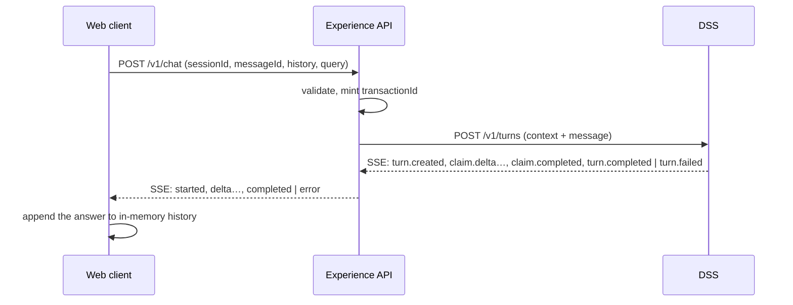
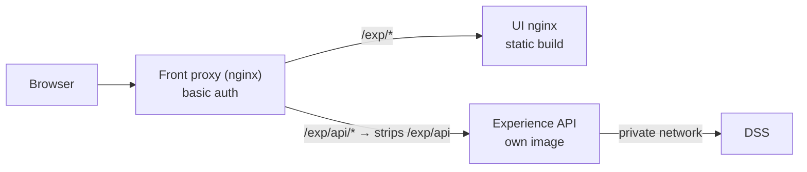

# Experience API — contract

**Status:** Draft, owned by this repo. The web client builds against it.
Changes since it moved here from the web client repo are marked *(amended)* and
listed in §8.3.

---

## 0. How to use this doc

Two pieces of work are built from this at the same time: the web client
(this repo) and the Experience API (a new repo). This doc is the only thing
they share.

| Section | Who reads it |
|---|---|
| §1–§2 Scope, deployment | Both |
| **§3–§6 The contract** — ids, request, response, errors | **Both. The shared interface** |
| §7 Building the DSS request | Experience API only |
| §8 Decisions and open questions | Both |
| §9 Client changes | Web client only |
| [ADR-0001](../ADR/0001-architecture.md) | Experience API only |
| `experience-api-fixtures/` in the web client repo | Reference only. Sample files for the examples in this doc. **Not required** — parked (§8.2) |

Rules for working in parallel:

- **§3–§6 are the contract.** Neither side changes its behaviour away from
  them. A change is made **here first**, then in code.
- The client builds against its own stubs, with no running API. The API builds
  against a fake DSS, with no running client.

---

## 1. What this covers

The Experience API sits between this web client and the DSS. The client sends a
chat turn; the API builds a DSS `/v1/turns` request, calls the DSS, and sends
the answer back.

For this story:

- History lives **only in the browser, in memory**. A refresh starts over.
- The client sends the **whole history with every turn**.
- The API **stores nothing**. It is stateless: no database, no session store.

Out of scope for now: images, voice, text-to-speech, suggestions, sign-in,
saved history across refreshes.

Sources read for this draft:

- DSS contract: `decision-support-system/docs/api-contracts/api-contract.md`
- DSS live wire code: `decision-support-system/src/dss/adapters/http/v1/`
  (`schema.py`, `router.py`, `sse.py`, `mapping.py`). Where the DSS's prose
  contract and its code differ, this doc follows the code (§8.2).
- Client: `src/lib/api-service.ts`, `src/hooks/store/chat/index.ts`,
  `src/lib/auth/index.tsx`

---

## 2. Where it sits



| Concern | Owner |
|---|---|
| Conversation history (storage, what goes in it) | Web client |
| Session id | Web client |
| Channel, response length, request timestamp, DSS envelope | Experience API |
| Deciding a conversation is too long | DSS (the API relays it, §6.2) |
| Answering the question | DSS |

The API contract is **shaped for the client, not for the DSS**. The client
never sees `context`, `message.input`, `userContext` or DSS event names. That
keeps the DSS free to change without touching the client, which is the point of
having an Experience API at all.

### 2.1 Deployment



- The browser sees one origin. The UI is at `/exp/`, the API at `/exp/api/`.
  No CORS.
- The front proxy **strips `/exp/api`**. The browser calls
  `/exp/api/v1/chat`; the API receives `/v1/chat`. The API knows nothing about
  where it is mounted.
- **Where the client sends requests is configurable.** A new `api.baseUrl` in
  `config.json` (runtime, no rebuild), set to `/exp/api` for this deployment.
  The client calls `{api.baseUrl}/v1/chat`. Use an absolute path, not
  `api/…`: a relative one resolves against the current page and breaks on any
  deeper route.
- Repointing `api.baseUrl` to **another origin** needs two more changes: CORS
  on the API, and the UI's CSP `connect-src`, which today allows `'self'` only.
- Basic auth is the proxy's job. The browser resends the credential on every
  same-origin request by itself, so the client and the API do nothing. The API
  ignores any `Authorization` header it is passed.
- The API reaches the DSS over a private network. No token; the DSS does no
  authentication.

What the front proxy must set on `/exp/api/`:

| Setting | Why |
|---|---|
| `proxy_buffering off` | Otherwise nginx holds the stream and the answer arrives all at once |
| `proxy_read_timeout` ≥ 120 s | The whole-turn timeout (§6.3). nginx's default is 60 s |
| `client_max_body_size` above the DSS cap (1 MB) | So the DSS, not the proxy, decides "too long" (§6.2) |

No rate limiting for now. Basic auth already keeps strangers out.

---

## 3. Identifiers

| Id | Minted by | When | Sent to DSS as | Required by DSS |
|---|---|---|---|---|
| `sessionId` | Client | Page load, and again on "clear chat" | `context.sessionId` | Yes |
| `messageId` | Client | Each new user message | `context.messageId` | No |
| `transactionId` | Experience API | Each HTTP request | `context.transactionId` | Yes |
| `traceId` | DSS (equals `transactionId` today) | Response | — | — |
| `resMessageId` | DSS | Response | — | — |

**`sessionId`** — a UUID v4 from `crypto.randomUUID()`, held in the chat store,
never in `localStorage`. It lives exactly as long as the history does: refresh
or "clear chat" gives a new one. The API passes it through unchanged. The DSS
uses it to group turns in traces; it does not use it to look anything up.

**`transactionId`** — the DSS requires it and uses it as the request's trace
id. It identifies *one attempt*, so the API mints a fresh UUID each time it
sends a turn to the DSS *(amended)*. A request rejected before that has none.
The client does not send it. It comes back as `traceId` on `started` and on the
`FinalAnswer`, so a "something went wrong" message can show it.

**`messageId`** — optional on the DSS, which mints one if absent. We send it
anyway: the client already gives every message a UUID (`makeUserMessage`), and
one id then follows a message from the browser into DSS traces. A **retry of
the same message reuses the same `messageId`** and gets a new `transactionId`.
The DSS does not dedupe on it today (its own open item).

**`assistantMessageId`** — the DSS's `resMessageId`. The client uses it as the
assistant bubble's id.

---

## 4. Request — client to Experience API

The browser calls `{api.baseUrl}/v1/chat` (`/exp/api/v1/chat`); the API
serves it as `/v1/chat` (§2.1).

```
POST /v1/chat
Content-Type: application/json
Accept: text/event-stream          (anything else, or absent = JSON)
traceparent: 00-…                  (optional)
```

Example in the parked fixtures: `request/follow-up.json`

```json
{
  "sessionId": "68a3872f-3f0d-4cf6-99a3-a350132a0080",
  "messageId": "1ab38d6c-6fdb-4849-8ea1-da5e80a8687c",
  "query": "And what about tomorrow?",
  "history": [
    { "role": "user", "text": "What is the weather today at my location?" },
    { "role": "assistant", "text": "Nashik is clear today, 31°C, no rain expected." }
  ],
  "language": { "source": "en", "target": "en" },
  "location": { "latitude": 20.0059, "longitude": 73.7898 }
}
```

| Field | Type | Required | Rule |
|---|---|:--:|---|
| `sessionId` | string, UUID | Yes | |
| `messageId` | string, UUID | Yes | Id of the message in `query` |
| `query` | string | Yes | Not empty after trimming |
| `history` | array | Yes | May be empty. Oldest first. Alternating is not required. Too long → `413` (§6.2) |
| `history[].role` | `user` \| `assistant` | Yes | |
| `history[].text` | string | Yes | Not empty after trimming |
| `language.source` | BCP 47 | Yes | Matches `^[A-Za-z]{2,3}(-[A-Za-z0-9]{1,8})*$` — the DSS's own check. e.g. `en`, `hi`, `hi-IN` |
| `language.target` | BCP 47 | Yes | Same |
| `location` | object | No | Omitted when the browser prompt is denied |
| `location.latitude` | number | With `location` | −90 to 90 |
| `location.longitude` | number | With `location` | −180 to 180 |

Why `query` is separate from `history`: the current message is explicit rather
than "the last user entry". The DSS treats the last `user` message as the
question; the API builds that ordering, so the client cannot get it wrong.

Why `latitude` / `longitude` and not GeoJSON: it is what the browser gives, and
the `[lon, lat]` order is a classic bug. The API does the conversion once.

Unknown fields are rejected (`422`), matching the DSS's own rule. So is a
`Content-Type` other than `application/json`.

**Anything the DSS would reject, the API rejects first**, with `422`. A DSS
rejection therefore always means an API bug, and is reported as
`502 upstream_error`.

### 4.1 What the client puts in `history`

- Every **completed** exchange, in order: the user's text, then the assistant's
  final answer text.
- The assistant text is the text of all `content` items from `completed`
  (text and refusal), joined by a blank line (`"\n\n"`).
- **Left out:** any turn that ended with an `error` — an `error` event, an
  error status, or a `completed` carrying `error` (§5.3). Also left out: a
  turn that is still streaming. The user message of a failed turn stays out
  too, so a Retry sends it as `query` again, not twice.
- **Kept:** every other outcome, including `rejected`, `no_match` and
  `requires_input`. A `requires_input` question must be in history, or the
  DSS cannot link the user's reply to it.
- When stubs are on, nothing reaches the API, so stub replies never enter a
  real request.

---

## 5. Response — Experience API to client

The API sends response headers only once the DSS has accepted the turn. So:

- anything that goes wrong **before** that is an HTTP error status (§6);
- anything that goes wrong **after** is inside a `200` — a terminal `error`
  event on SSE, or an error status on JSON (the API has not written anything
  yet in JSON mode, so it still can).

### 5.1 Streaming (`Accept: text/event-stream`)

Four events. Every `data` line is one JSON object carrying `sequence`: the
API's own counter, starting at 1, up by one per event. No `id:` lines — a
stream cannot be resumed.

| Event | When | `data` |
|---|---|---|
| `started` | First, once the DSS has accepted the turn | `{ sequence, sessionId, messageId, assistantMessageId, traceId }` |
| `delta` | Each piece of answer text | `{ sequence, text }` |
| `completed` | Last. The final answer. **Authoritative** | `{ sequence, …FinalAnswer (§5.2) }` |
| `error` | Last. The turn broke mid-stream | `{ sequence, error: Error (§6) }` |

Guarantees the client can rely on:

1. **Exactly one of `completed` or `error` ends every stream.** The client
   never decides success from the connection closing. A stream that closes
   without one is a failure, treated as `upstream_error`.
2. `started` comes first when there is one. An `error` may arrive without a
   `started` before it.
3. **`delta` text is the DSS's text, passed through unchanged.** The client
   appends each piece. Line breaks and formatting are whatever the DSS's
   Markdown carries; the API adds nothing.
4. On `completed`, the client **replaces** the running text with
   `completed.content`. That is the authoritative answer — including any
   content the DSS sent whole rather than as deltas. Citations exist only
   there, since a half-written block has nothing to point at.

Example in the parked fixtures: `stream/answered.sse`

```
event: started
data: {"sequence":1,"sessionId":"68a3872f-3f0d-4cf6-99a3-a350132a0080","messageId":"1ab38d6c-6fdb-4849-8ea1-da5e80a8687c","assistantMessageId":"8d2f4b61-93c7-4e0a-b1f5-2a7c9e3d6f10","traceId":"3c67dc05-6ba2-4ab4-bb7c-377e16a5ab5b"}

event: delta
data: {"sequence":2,"text":"Tomorrow in Nashik "}

event: delta
data: {"sequence":3,"text":"expect light rain after 3 pm."}

event: completed
data: {"sequence":4, …the FinalAnswer in 5.2…}
```

### 5.2 FinalAnswer (also the `Accept: application/json` body)

Example in the parked fixtures: `response/answered.json`

```json
{
  "sessionId": "68a3872f-3f0d-4cf6-99a3-a350132a0080",
  "messageId": "1ab38d6c-6fdb-4849-8ea1-da5e80a8687c",
  "assistantMessageId": "8d2f4b61-93c7-4e0a-b1f5-2a7c9e3d6f10",
  "traceId": "3c67dc05-6ba2-4ab4-bb7c-377e16a5ab5b",
  "outcome": { "status": "answered", "cause": null },
  "content": [
    {
      "type": "text",
      "text": "Tomorrow in Nashik expect light rain after 3 pm.",
      "citations": [{ "sourceId": "src_1", "start": 0, "end": 48 }]
    }
  ],
  "sources": [
    { "id": "src_1", "name": "IMD", "url": "https://mausam.imd.gov.in/" }
  ]
}
```

| Field | Required | Notes |
|---|:--:|---|
| `sessionId`, `messageId`, `assistantMessageId`, `traceId` | Yes | §3 |
| `outcome.status` | Yes | `answered`, `partially_answered`, `rejected`, `no_match`, `requires_input`, `unavailable`. For logs; the client does not branch on it (§5.3) |
| `outcome.cause` | Yes, may be `null` | Open set, passed through. Treated as an opaque string |
| `content` | Yes, may be `[]` | In order. Empty only when `error` is present |
| `content[].type` | Yes | `text` or `refusal` |
| `content[].text` | Yes | Markdown, as today |
| `content[].citations` | `text` only; may be `[]` | `start`/`end` are Unicode code-point offsets into `text` |
| `sources` | Yes, may be `[]` | `{ id, name, url? }`. What citations point at |
| `error` | No | Present only when the turn failed. `Error` shape (§6) |

`confidence` is dropped on purpose: nothing in the client should act on it yet.
It is easy to add later.

### 5.3 How the client renders each outcome

**The client draws `content` and checks `error`. It never picks words by
status.** The DSS writes user-facing `content` in the user's language, and its
contract calls that content authoritative for display. The API passes it
through untouched.

| Status | What is in `content` | What the client does | Example |
|---|---|---|---|
| `answered` | The answer, with citations | Draws it | `response/answered.json` |
| `partially_answered` | A mix — answer, a refusal for part of the ask, maybe a question | Draws each item in order | `response/partially-answered.json` |
| `rejected` | A `refusal` item | Draws it, styled as a refusal | `response/rejected.json` |
| `no_match` | Text ("I could not find a source for that") | Draws it | `response/no-match.json` |
| `requires_input` | A question back ("Which district?") | Draws it. The user's next message is the reply | `response/requires-input.json` |
| `unavailable` | Text saying what is down, **or nothing**, plus `error` | Draws `content`; if empty, shows its own message for `error.code`. Retry if `error.retryable`. Kept out of history | `response/unavailable.json`, `response/unavailable-internal.json` |

The client branches on exactly two things:

1. **`content[].type`** — `text` or `refusal`, for styling.
2. **`error`** — present means the turn failed: show Retry when
   `error.retryable` is true, and keep the turn out of history.

A failure reaches the client one of two ways, and both use that one rule:

- **`completed` with `error`** — the DSS finished the turn, but something it
  needed was down. `content` usually says what; after an internal DSS fault it
  is empty. `error.code` is the DSS's cause (an open set, e.g.
  `provider_unavailable`, `internal`), shown only if `content` is empty.
- **An `error` event, or an error status** — the call itself broke (§6). There
  is no DSS text; the client shows its own message for `error.code`.

A status the client has never seen needs no change: it still draws `content`
and checks `error`.

---

## 6. Errors

One `Error` shape everywhere — the HTTP error body, the `error` event, and
`FinalAnswer.error`:

```json
{
  "error": {
    "code": "busy",
    "message": "The assistant is busy. Try again shortly.",
    "retryable": true,
    "retryAfterSeconds": 5
  }
}
```

| Field | Required | Notes |
|---|:--:|---|
| `code` | Yes | §6.1. **The client branches on this, never on `message`** |
| `message` | Yes | For logs and developers. English. Never shown as-is |
| `retryable` | Yes | Whether pressing Retry could work |
| `retryAfterSeconds` | No | Wait this long before retrying |

*(Amended.)* `Error` carries no `traceId` for now. A turn that reached the DSS
has one on `started`; a request rejected before the DSS has none that anything
could look up. Revisited when this repo adds OpenTelemetry (§8.3).

The words a user sees come from the client's own translation files, keyed by
`code`. An unknown `code` gets a generic "something went wrong", with Retry if
`retryable`.

### 6.1 Error codes

A closed set. Adding one is a contract change (§0).

| `code` | HTTP (before stream / JSON) | Also as `error` event | `retryable` | Cause | Example |
|---|---|:--:|:--:|---|---|
| `malformed_request` | 400 | — | No | Body is not JSON | `error/malformed-request.json` |
| `invalid_request` | 422 | — | No | JSON that breaks §4's rules | `error/invalid-request.json` |
| `history_too_large` | 413 | — | No | DSS said the body is too large (§6.2) | `error/history-too-large.json` |
| `busy` | 429 | — | Yes | DSS `429 capacity_reached`. `retryAfterSeconds` from its `Retry-After` | `error/busy.json` |
| `upstream_unavailable` | 503 | — | Yes | DSS unreachable, or DSS `503 not_ready` | `error/upstream-unavailable.json` |
| `timeout` | 504 | Yes | Yes | DSS too slow (§6.3) | `error/timeout.json`, `stream/error-timeout.sse` |
| `upstream_error` | 502 | Yes | Yes | DSS sent something invalid, any other DSS error status, or the DSS stream broke | `error/upstream-error.json`, `stream/error-upstream.sse` |
| `internal_error` | 500 | Yes | Yes | A bug in the API | `error/internal-error.json` |
| `not_found` | 404 | — | No | Unknown path. The client never sends one; listed so every body has our shape | `error/not-found.json` |
| `method_not_allowed` | 405 | — | No | e.g. `GET /v1/chat` | `error/method-not-allowed.json` |

*(Amended.)* In the first build `malformed_request`, `invalid_request`,
`not_found` and `method_not_allowed` are not yet produced. FastAPI's defaults
answer instead: `422`, `404` or `405` with `{"detail": ...}`, and a body that is
not JSON is a `422` too. The client treats any error body without `error.code`
by its HTTP status. Whether to keep this is decided at peer review (§8.3).

`FinalAnswer.error.code` is the one place a code outside this table appears: it
is the DSS's own cause, passed through (§5.3).

### 6.2 Conversation too long

The DSS decides how much is too much. The API sets no size limit of its own and
does no trimming.

1. The DSS returns `413 payload_too_large` when the uncompressed body is over
   its `max_body_bytes` (default 1,000,000 bytes).
2. The API relays it as `413` with code `history_too_large`.
3. The client shows "This conversation is too long. Refresh the page to start
   a new one." No Retry button: the same history fails the same way.
4. A refresh clears history and mints a new `sessionId`, so the next turn fits.

**Everything in front of the DSS must allow a bigger body than the DSS does.**
Otherwise it answers `413` first, without our error code. The API sets no body
limit of its own (FastAPI and uvicorn have none by default), so this means the
front proxy's `client_max_body_size` (nginx default 1 MB, §2.1). As a fallback, the client treats any `413` whose body has
no `error.code` as `history_too_large`.

### 6.3 Timeouts

| Limit | Default | What happens past it |
|---|---|---|
| DSS accepts the turn (response headers and its first event) | 30 s | `504 timeout` |
| Whole turn | 120 s | `error` event `timeout` (SSE) or `504 timeout` (JSON) |

*(Amended.)* Neither timer is in the first build. It lands after the real DSS
client; until then the HTTP client's own connect and read timeouts are the
safety net.

---

## 7. Building the DSS request *(Experience API only)*

Example in the parked fixtures: `dss-request/follow-up.json`
is what the API sends for `request/follow-up.json`.

```json
{
  "context": {
    "id": "api.dss.turn",
    "timestamp": "2026-09-23T08:00:00Z",
    "sessionId": "68a3872f-3f0d-4cf6-99a3-a350132a0080",
    "transactionId": "3c67dc05-6ba2-4ab4-bb7c-377e16a5ab5b",
    "messageId": "1ab38d6c-6fdb-4849-8ea1-da5e80a8687c"
  },
  "message": {
    "input": [
      { "role": "user", "content": [{ "type": "text", "text": "What is the weather today at my location?" }] },
      { "role": "assistant", "content": [{ "type": "text", "text": "Nashik is clear today, 31°C, no rain expected." }] },
      { "role": "user", "content": [{ "type": "text", "text": "And what about tomorrow?" }] }
    ],
    "attributes": {
      "channel": "web",
      "sourceLanguage": "en",
      "targetLanguage": "en",
      "location": {
        "geometry": { "type": "Point", "coordinates": [73.7898, 20.0059] }
      },
      "response": { "maxCharacters": 1200 }
    },
    "userContext": [{ "type": "identity", "userId": "anonymous" }]
  }
}
```

| DSS field | Comes from |
|---|---|
| `context.id` | Constant `api.dss.turn` |
| `context.timestamp` | API clock, at request time (not the browser's) |
| `context.sessionId` | Client `sessionId` |
| `context.transactionId` | Minted by the API, one per request |
| `context.messageId` | Client `messageId` |
| `context.version` | Omitted. It is a DSS response field |
| `message.input` | `history` as sent, then `query` as the last `user` item. Each text becomes `[{ "type": "text", "text": … }]` |
| `attributes.channel` | API config. `web` for this client |
| `attributes.sourceLanguage` / `targetLanguage` | Client `language.source` / `.target` |
| `attributes.location.geometry.coordinates` | `[longitude, latitude]` — note the swap |
| `attributes.location.region` / `.area` | Omitted, by decision (§8.1) |
| `attributes.response.maxCharacters` | API config, per channel |
| `userContext` | `[{ "type": "identity", "userId": "anonymous" }]` until sign-in exists |

Headers to DSS: `Content-Type: application/json`, `Accept: text/event-stream`
(the API always streams from the DSS, even for a JSON client, and drains it),
and `traceparent` so one trace spans client → API → DSS. `Content-Encoding:
gzip` is supported by the DSS and worth using, since history grows each turn.

### 7.1 DSS responses back to the client

**`turn.failed` is not a broken stream.** In the live DSS it is the terminal
event for any `unavailable` turn: a full response, with `outcome`, maybe
`content`, and `error` (`sse.py` `_terminal_name`). It maps to our
`completed`, not our `error`.

| From the DSS | To the client |
|---|---|
| first frame (normally `turn.created`) | `started`; `assistantMessageId` from its `context.resMessageId` |
| `claim.delta` (`output_text_delta`) | `delta`, text unchanged |
| `claim.completed` | nothing — `completed` carries every block |
| `turn.completed` | `completed` |
| `turn.failed` | `completed`, with `error` |
| stream ends with no terminal event, or a frame fails to parse | `error` event `upstream_error` |
| HTTP 413 `payload_too_large` | `413 history_too_large` |
| HTTP 429 `capacity_reached` | `429 busy` |
| HTTP 503 `not_ready`, or connection refused | `503 upstream_unavailable` |
| any other HTTP error (400, 406, 415, 422, 5xx) | `502 upstream_error`. A bad DSS request is the API's bug, not the client's; logged with the DSS body |

Reshaping a terminal frame into `FinalAnswer`:

| DSS (`message.…` / `context.…`) | FinalAnswer |
|---|---|
| `context.sessionId`, `messageId`, `traceId`, `resMessageId` | `sessionId`, `messageId`, `traceId`, `assistantMessageId` |
| `outcome.status`, `outcome.cause` | `outcome.status`, `outcome.cause`. `confidence` dropped |
| `content[]` `text` | `{ type: "text", text, citations }` |
| `content[].annotations[]` (`url_citation`) | `citations[]`: `sourceId`, `startIndex` → `start`, `endIndex` → `end`. `url`/`sourceName` dropped — they are on `sources` |
| `content[]` `refusal` | `{ type: "refusal", text }` |
| `sources[]` | `{ id, name, url }`. `kind` dropped |
| `error` (`code`, `message`, `retryable`, `retryAfterSeconds`) | `error`, same fields |

Sample DSS streams, one per outcome: `dss-stream/` in the parked fixtures
(reference only).

---

## 8. Decisions and open questions

### 8.1 Decided

| Question | Decision |
|---|---|
| Location sent to the DSS | Coordinates only. `region` and `area` left out. Revisit if the DSS answers location questions badly without them |
| Endpoint name | `POST /v1/chat`, distinct from the DSS's `/v1/turns` |
| How the browser reaches the API | Same origin behind the front proxy; configurable `api.baseUrl` (§2.1) |
| Mount path | Proxy strips `/exp/api`; the API serves `/v1/chat` |
| API-to-DSS auth | Network isolation. No token for now |
| Rate limiting | None for now. Basic auth at the proxy |
| Response formats | Both SSE and JSON, chosen by `Accept` |
| Over-long conversations | DSS decides; API relays as `history_too_large`; user refreshes (§6.2) |
| API stack | Python + FastAPI, following the DSS's conventions (ADR-0001) |

### 8.2 Still open

1. **The DSS's prose and code disagree in places.** The live code is what
   counts: `transactionId` is required, `messageId` optional, only `text`
   content is accepted (no `image` yet), unknown fields are rejected, and an
   `unavailable` turn ends with `turn.failed`, not `turn.completed`. ADR-0004
   and `orchestration/envelope.py` describe an older request shape — worth
   flagging to the DSS team.
2. **The DSS sample's coordinates are wrong.** `[73.7898, 28.6139]` is
   Nashik's longitude with Delhi's latitude. Nashik is about `[73.79, 20.01]`.
3. **Client auth.** None today; `userId` is `anonymous`. When sign-in lands,
   the API derives `userId` from the credential — the client never sends it.
4. **Body size vs the model's context window.** The DSS's only limit today is
   body size (1 MB). A long conversation could fit in 1 MB yet overflow the
   model's context window, and fail some other way. The DSS team should say
   whether it returns `payload_too_large` for that too.
5. **Keep-alives — parked.** The DSS sends none, and can go quiet while it
   looks things up; nginx drops a silent connection after 60 s by default. A
   standard SSE comment line (`: ping`) every 15 s would prevent that.
   Before deciding: mock the DSS to stay silent for more than 60 s, and see
   what the front proxy and the client actually do. Not needed for the first
   build. (The client's SSE parser should still ignore `:` comment lines,
   since that is standard SSE.)
6. **Fixture-based testing — parked.** `experience-api-fixtures/` holds sample
   files for every example here, checked against the live DSS models. Whether
   the two builds test against them is not decided. Until then they are
   reference only, and neither build depends on them.

---

### 8.3 Amendments since the move

| Section | Was | Now | Why |
|---|---|---|---|
| §3, §6 | `transactionId` minted before validation; `traceId` on every `Error` | Minted when the turn is sent to the DSS; `Error` has no `traceId` | It only means something in DSS traces. Redesigned with OpenTelemetry |
| §6.1 | `400 malformed_request`, `422 invalid_request`, `404`, `405` in our shape | FastAPI's defaults in the first build | Keep the first cut thin. Decide at peer review |
| §6.3 | Both timeouts | Deferred until after the real DSS client | Not needed for the first cut |
| §0 | Links to the architecture doc and the fixtures | Links to ADR-0001; fixtures named, not linked | They live in another repo now |

## 9. What changes in this client *(web client only)*

- The API URL moves from the hard-coded `apiUrl: ''` in
  `src/lib/config/environment.ts` to `api.baseUrl` in `config.json`.
- `sendUserQuery` moves from `GET /api/chat/?query=…` to
  `POST {api.baseUrl}/v1/chat` with a JSON body. `EventSource` cannot `POST`,
  so it stays `fetch` + a stream reader, now parsing SSE frames (`event:` /
  `data:` / blank line; ignore `:` comments) instead of raw text.
- The chat store mints `sessionId` in `initializeSession` and again in
  `clearChat`, and builds `history` from `messages` per §4.1.
- The assistant bubble takes its id from `assistantMessageId` and its final
  content from `completed.content`.
- Errors: branch on `error.code` (§6.1), with a translation per code. On
  `history_too_large` (or a bare `413`), show the refresh message and no Retry.
- An `unavailable` answer with empty `content` shows the client's own message
  for its `error.code`.
- Stubs keep working: `stubSendUserQuery` emits the same events as §5.1, so
  the stubbed path exercises the real parser.
- ADR-0000 §6.1 changes when the stub flag flips off.
